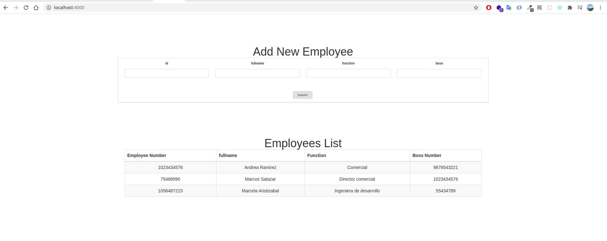
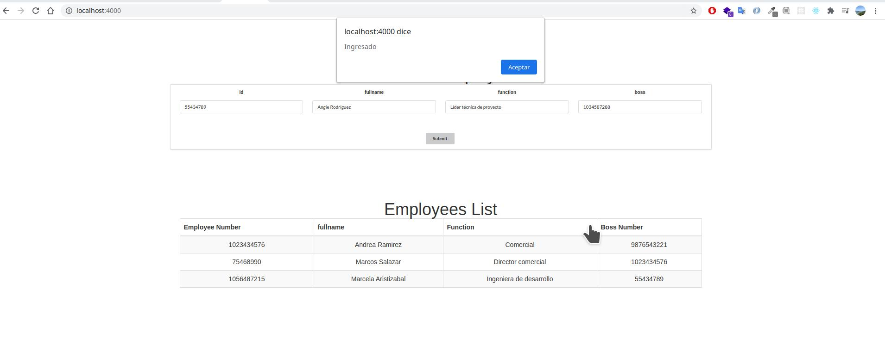
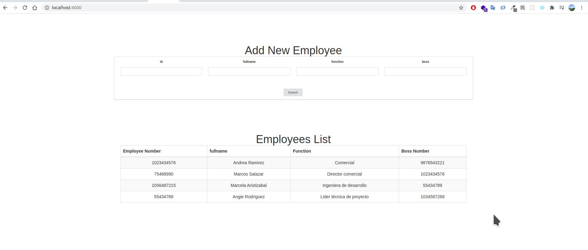

# Employees Management Web App

This is a web app for managing employees data, mainly to know the hierarchy on the companies.

## Getting Started

These instructions will get you a copy of the project up and running on your local machine for development and testing purposes. See deployment for notes on how to deploy the project on a live system.

### Prerequisites

The software used to develop the application is listed below, but really you just need docker, docker compose ang Git.

```
NodeJS 12.16.3
Docker 19.03.12
Docker-compose 1.26.2
PostgreSQL 12.4.1
Git 2.28.0
```

You can click on the next links to install the software we need for running this web app. You can find a set of instructions that tell you how to install Git, Docker and Docker Compose for your OS and distribution.

* [install Docker Engine](https://docs.docker.com/engine/install/) - container technology

* [install Docker Compose](https://docs.docker.com/compose/install/) - Tool for defining and running multi-container Docker applications.

* [install Git](https://git-scm.com/book/en/v2/Getting-Started-Installing-Git) - Version control system.

### Installing

Now lets continue with the steps to install the Employees Management Web App. 


1) Clone the repo. Type on the terminal:

```
$ git clone https://github.com/LeonelVinasco/appBdB
```

Go to the main folder

```
$ cd appBdB
```

Build:

```
$ sudo docker-compose --build

```
Now the 4 containers were builded. client, api, postgres and test.


### Test Locally

At the moment the project has been built. 

Run:
```
$ sudo docker-compose up
```

Open your browser and go to the following url

```
http://localhost:4000
```

Now you'll see the web interface that appears in the next image:



At the top you can see 4 fields to fill with the employee information. The fields added to the database where employee_number, a unique identificator for every person, and boss_number. The only field allowed to be not null is the boss_number because the owner of the company couldnt have any boss.



When you type the data and press enter or click the submit button, a confirmation dialog will appear telling you that the operation was made succesfully.
Then when you click Accept, the person will appear at the bottom of the data table.



## API Documentation

This API uses POST request to communicate and HTTP response codes to indenticate status and errors. All responses come in standard JSON. All requests must include a content-type of application/json and the body must be valid JSON.

As i told before the web app have 4 containers. One of this is the server, where is implemented the CR operations. This server is exposed on the port 3000. The client is expose on the port 4000. So if you want to make operations with the employees connecting to the API you have to use this url.

```
http://localhost:3000
```

The routes you can use to make operations are:

```
http://localhost:3000/employee/add
```

and

```
http://localhost:3000/employee/setboss
```

The setboss operation updates an employee's boss.

## Response Codes 
### Response Codes
```
200: Success
409: The ID you are trying to insert already exists in the database.
500: Server Error
```
## Add Employee
**You send:**  The employee data.
**You get:** An success message.

**Request:**
```json
POST /employee/add HTTP/1.1
Accept: application/json
Content-Type: application/json

{
    "id": "5478934",
    "fullname": "Camila Rodríguez" ,
    "func": "Manager",
    "boss": "45678912"
}
```

## Set Boss
**You send:**  The employee and the boss id number.
**You get:** A success message.

**Request:**
```json
POST /employee/setboss HTTP/1.1
Accept: application/json
Content-Type: application/json

{
    "id": "5478934",
    "boss": "45678912"
}
```

## List Employees
**You send:**  A get request to 'http:localhost:3000/'.
**You get:** A JSON data array with all the employees data.

**Request:**
```json
GET / HTTP/1.1
```

## Running the tests

The test container runs the unit test automatically when you run the docker-compose command. If you want to add tests, add them to the file server/tests/employee.test.js or add a new file *.test.js that the program will automatically run it.


### Break down into end to end tests

The test includes on the project, test the api functionality. Especifically their 3 functions. Add a new employee, set a employee boss, and list all the employees.


## Built With

* [NodeJS](https://nodejs.org/es/docs/) - Javascript server side development environment 
* [Semantic UI](https://semantic-ui.com/) - Front-end development framework
* [Express](https://expressjs.com/) - Web application framework for Node. js


## Authors

* **Leonel Vinasco** - *Initial work* - [GITHUB](https://github.com/leonelvinasco)

## License

This project is licensed under the MIT License - see the [LICENSE.md](LICENSE.md) file for details

## Acknowledgments

* To the BdB Human Resources dependecy
* To the engineers that made the skills test
